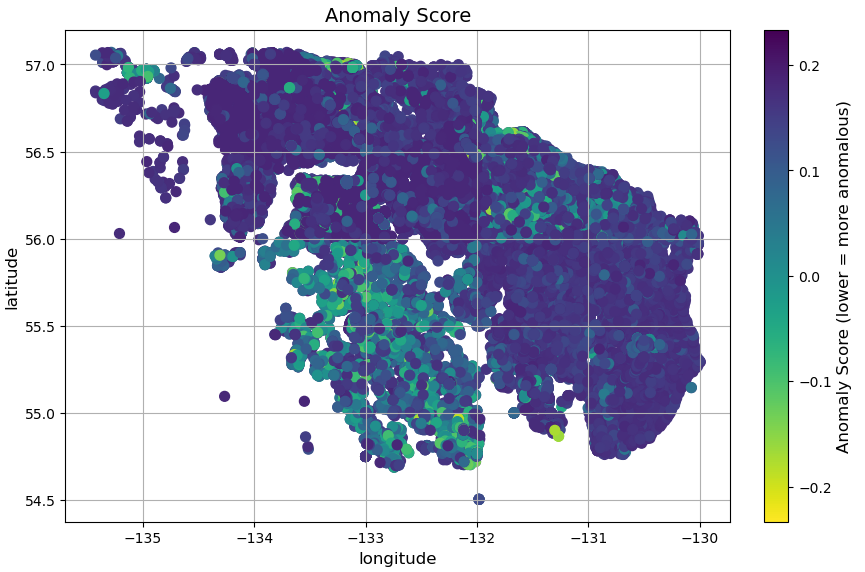

# **Multivariate Outlier Detection in Geochemical Datasets**
#### *Tyler Howe, February 2025*

This repository provides an open-source resource for exploring, analyzing, and comparing three different methods of multivariate outlier detection in geochemical datasets in the context of mineral exploration.

## **Outlier Detection Methods**
The three primary outlier detection algorithms explored in this project are:

- **Isolation Forest (IF)** – *(Liu et al., 2008)*
- **Local Outlier Factor (LOF)** – *(Breunig et al., 2000)*
- **Angle-Based Outlier Detection (ABOD)** – *(Kriegel et al., 2008)*

These techniques aim to identify geochemical anomalies that may indicate mineralization zones or other significant geological features.

## **Background**
This work is inspired by Antoine Caté's research on multivariate outlier detection for mineral exploration and builds upon various established anomaly detection methodologies.

## **Installation & Usage**
To run the notebook, ensure you have the following dependencies installed:

### **Built-in Modules**
- `time`
- `importlib`
- `typing.Tuple`

### **Third-Party Libraries**
- `pandas`
- `numpy`
- `matplotlib.pyplot`
- `seaborn`
- `scipy.spatial` (`cKDTree`, `KDTree`)
- `scipy.stats` (`f_oneway`)
- `sklearn.ensemble` (`IsolationForest`)
- `sklearn.neighbors` (`LocalOutlierFactor`)
- `sklearn.preprocessing` (`StandardScaler`)
- `sklearn.decomposition` (`PCA`)
- `sklearn.metrics` (`roc_auc_score`, `roc_curve`, `auc`, `mutual_info_score`)

## **References**
- Breunig, M.M., Kriegel, H.-P., Ng, R.T., and Sander, J., 2000, LOF: Identifying density-based local outliers: *ACM SIGMOD Record*, v. 29, no. 2, p. 93–104. [https://doi.org/10.1145/335191.335388](https://doi.org/10.1145/335191.335388)
- Caté, A., 2025, 6: Multivariate outlier detection for mineral exploration: *LinkedIn Pulse*, accessed February, 2025, at https://www.linkedin.com/pulse/6-multivariate-outlier-detection-mineral-exploration-antoine-cat%C3%A9-vd4kc/. 
- Granitto, M., Schmidt, J.M., Shew, N.B., Gamble, B.M., and Labay, K.A., 2013, Alaska Geochemical Database Version 2.0 (AGDB2)—Including "Best Value" data compilations for geochemical data for rock, sediment, soil, mineral, and concentrate sample media: *U.S. Geological Survey Data Series 759*, Version 1.0, Denver, CO, accessed February, 2025, at https://doi.org/10.3133/ds759.
- Kriegel, H.-P., Schubert, M., and Zimek, A., 2008, Angle-based outlier detection in high-dimensional data: *Proceedings of the 14th ACM SIGKDD International Conference on Knowledge Discovery and Data Mining*, Las Vegas, Nevada, USA, Association for Computing Machinery, p. 444–452. [https://doi.org/10.1145/1401890.1401946](https://doi.org/10.1145/1401890.1401946).
- Liu, F.T., Ting, K.M., and Zhou, Z.-H., 2008, Isolation Forest: *Eighth IEEE International Conference on Data Mining*, p. 413–422. [https://doi.org/10.1109/ICDM.2008.17](https://doi.org/10.1109/ICDM.2008.17).
- Maklin, C., 2022, Isolation Forest: *Cory Maklin - Medium*, accessed at [https://medium.com/@corymaklin/isolation-forest-799fceacdda4](https://medium.com/@corymaklin/isolation-forest-799fceacdda4).
- Saudi Geological Survey (SGS), [2023], [Dataset RGP GSAS Geochemical survey Jabal Al Hasir]: *Saudi Geological Survey Data Portal*, accessed [February, 2025], at [https://ngdp.sgs.gov.sa/ngp/].
- Saudi Geological Survey (SGS), [2023], [Mineral Occurrence Documentation System (MODS) Database]: *Saudi Geological Survey Data Portal*, accessed [February, 2025], at [https://ngdp.sgs.gov.sa/ngp/].
- Shahrestani, S., and Sanislav, I., 2025, Mapping geochemical anomalies using angle-based outlier detection approach: *Journal of Geochemical Exploration*, v. 269. [https://doi.org/10.1016/j.gexplo.2024.107635](https://doi.org/10.1016/j.gexplo.2024.107635)
- U.S. Geological Survey (USGS), 2008, Alaska Resource Data File (ARDF): *U.S. Geological Survey Open-File Report 2008-1225*, accessed February, 2025, at https://mrdata.usgs.gov/ardf/.

